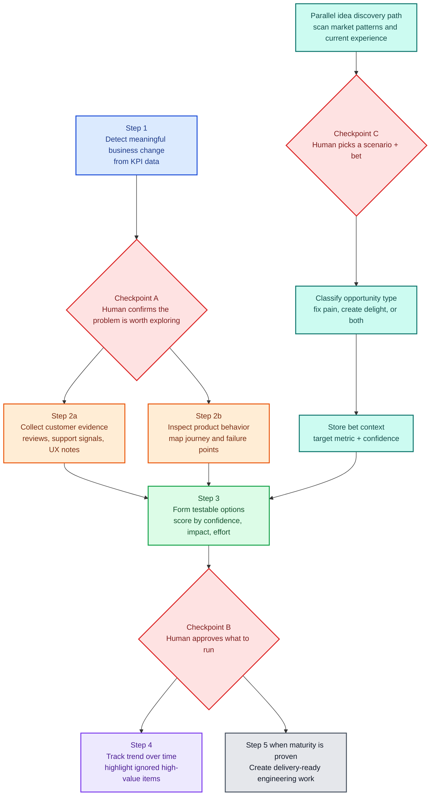

# Architecture Decision Document

## Project Context Analysis

### Requirements Overview

**Functional Requirements — Phase 1 (50 FRs across 8 capability groups):**

| Group | FRs | Architectural unit |
|---|---|---|
| Domo Signal Detection | FR1–5 | Signal agent (10) — queries KPI datasets, pages, cards via Domo MCP |
| Feedback Intelligence | FR6–13 | Feedback agent (11) — findings store, weekly refresh, PII enforcement |
| Evidence Validation (Feedback) | FR14–19 | Feedback agent (11) — Confluence/Jira UXR search, gap surfacing |
| Independent Code Review | FR20–21g | Validation agent (12) — journey mapping, A/B design, scoring |
| Hypothesis Management | FR22–24 | Loop state — dedup, park, resume |
| Experiment Prioritisation | FR25–28 | Prioritisation agent (13) — C×I×S scoring, ranking, PM gate, Jira |
| Registry & Configuration | FR29–33 | Config layer — dataset/page/card registry, thresholds, repo registry |
| Loop State & Memory | FR34–39 | Cycle state, findings store, ranked-hypotheses history |
| Inspiration Loop | FR40–50 | Inspiration scout (20), bet classifier (21, in design) |

### Technical Constraints & Dependencies

| Constraint | Impact |
|---|---|
| Claude Code CLI runtime | No server, no database — file-based persistence only |
| Domo MCP (external) | OAuth client_credentials; `data` scope for datasets, `dashboard` scope for pages/cards |
| Confluence/Jira MCP | Basic auth; write-scoped to configured page/project |
| GitHub MCP | Read-only; `sephora-asia` org |
| Single operator | No concurrent writes — acceptable for PM-triggered loops |

### Cross-Cutting Concerns

| Concern | Approach |
|---|---|
| PII | Exclusion at SQL SELECT layer; schema verification before unverified datasets |
| Token efficiency | Memory-first reads; aggregation-first SQL; MCP guardrails (`directives/mcp_token_guardrails.md`) |
| Determinism | DOE execution layer — scoring, flagging, caching, debt calculation pushed to `execution/` scripts |
| Error handling | Every agent SKILL.md has explicit fallback per failure mode |
| State integrity | Append-only files never overwritten; atomic writes via `.tmp` rename |

---

## Agent Decomposition

### Component Map

| Agent | Number | Phase | Responsibility | Execution scripts used |
|---|---|---|---|---|
| `10-signal-agent` | 10 | Intelligence | Query registered KPI sources; apply signal threshold; surface metric movements; PM gate | `flag_suspicious_metrics.py` |
| `11-feedback-agent` | 11 | Intelligence | Memory-first Domo feedback triangulation; Confluence UXR search; off-signal risk flagging | `check_findings_cache.py` |
| `12-validation-agent` | 12 | Intelligence | Local codebase survey; journey mapping; A/B experiment design; C/I/S scoring | `score_hypotheses.py`, `index_repos.py` |
| `13-prioritisation-agent` | 13 | Intelligence | Dedup; score C×I×S; rank; code grounding check; PM gate; Jira creation; lineage tracking | `resolve_config.py`, `score_hypotheses.py`, `verify_code_grounding.py` |
| `14-weekly-refresh` | 14 | Intelligence | Background — refresh findings store for all registered feedback datasets | `check_findings_cache.py` |
| `15-trend-escalation-agent` | 15 | Intelligence | Confidence/priority trends across cycles; priority debt; escalation flags | `calculate_priority_debt.py` |
| `20-inspiration-scout` | 20 | Inspiration | Signal + frontend browse + market scan; PM Gate 1; bet-log entry | `check_signals_staleness.py` |
| `05-funnel-monitor` | 05 | Action | Weekly ecommerce funnel report from Domo screenshots + Confluence | — |
| `06-market-intel` | 06 | Action | SEA web + social scanner — brand sentiment, competitor activity | — |
| `07-validation` | 07 | Action | Cross-references hypotheses with Confluence research + synthetic modeling | `score_hypotheses.py` |
| `08-github-reader` | 08 | Action | Reads sephora-asia repos for code context per hypothesis | `index_repos.py` |
| `09-jira-writer` | 09 | Action | Creates Jira stories under configured epic | `resolve_config.py` |

### Skills (Orchestrators)

| Skill | Trigger | Spawns | Phase |
|---|---|---|---|
| `intelligence-loop` | `/intelligence-loop` | 10 → 11+12 → 13 → 15 with PM gates | Intelligence (active) |
| `growth-engineer` | `/growth-engineer` | 05 → 06 → 07 → 08 → 09 with gates | Action (not yet active) |
| `puppeteer` | `/puppeteer` | — (runs `scripts/domo-capture.js`) | Action (utility) |

### Loop Orchestration

**Intelligence Loop (Phase 1 — active)**
```
PM triggers /intelligence-loop
       │
  10-signal-agent              ← Step 1: KPI signal from Domo
       │  *** PM GATE ***
       ├───────────────────────────────┐
  11-feedback-agent            12-validation-agent
  (Domo feedback + UXR)        (code review + A/B design)
       └───────────────────────────────┘
                  │  *** PM GATE ***
          13-prioritisation-agent      ← Step 3: score → rank → Jira
                  │                      Uses: score_hypotheses.py,
                  │                             verify_code_grounding.py
          15-trend-escalation-agent    ← Trend tracking + debt
                                         Uses: calculate_priority_debt.py

[Background — weekly]
  14-weekly-refresh  →  findings-store.json (append-only)
```

**Inspiration Loop (Phase 3 — active)**
```
PM triggers /inspiration-loop
       │
  20-inspiration-scout         ← Signal + browse + market scan
       │                         Uses: check_signals_staleness.py
       │  *** PM GATE 1 ***      (pre-mortem + prototype idea)
       │
  21-bet-classifier            ← (in design) pain / shine / pain+shine
       │
  22–24 (in design)            ← prototype → validate → track
```

Agent 20's `bet-log.json` feeds Agent 13 as optional enrichment (pm_odds tiebreaker + market context).

**Action Layer (Phase 2 — not yet active)**
```
/growth-engineer (unlock: ≥3 loops, ≥2/3 hypotheses actioned)
  Screenshot → 05-funnel-monitor → 06-market-intel
       *** GATE 1 ***
  05 → 07-validation
       *** GATE 2 ***
  05 → 08-github-reader → 09-jira-writer
```

### DOE Execution Layer

Deterministic scripts called by agents. Each has a matching directive in `directives/`.

| Script | Purpose | Used by |
|---|---|---|
| `resolve_config.py` | Merge global→team→local YAML config | Agents 09, 13 |
| `score_hypotheses.py` | C×I×S scoring + ranking + pm_odds tiebreak | Agents 07, 12, 13 |
| `verify_code_grounding.py` | Check file paths vs audit log + grep anchors | Agent 13 |
| `flag_suspicious_metrics.py` | YoY/zero/identical-segment flagging | Agent 10 |
| `check_findings_cache.py` | Staleness check + atomic append | Agent 11, 14 |
| `check_signals_staleness.py` | File-age check for signals.md | Agent 20 |
| `calculate_priority_debt.py` | Trend classification + debt + escalation flags | Agent 15 |
| `index_repos.py` | Structural file index for repo search optimisation | Agents 08, 12 |

### State & Persistence

| Artefact | Path | Mode |
|---|---|---|
| Intelligence cycle state | `outputs/prioritisation/ranked-hypotheses.json` | Append-only |
| Inspiration cycle state | `outputs/inspiration/cycle-state.json` | Overwrite per step |
| Bet log | `outputs/inspiration/bet-log.json` | Append-only |
| Findings store | `outputs/feedback/findings-store.json` | Append-only |
| Signal trend | `outputs/trend/signal-trend.json` | Overwrite each run |
| Pipeline context | `outputs/signal-agent/pipeline-context.md` | Overwrite each run |
| Experiment designs | `outputs/validation/experiment-designs.json` | Overwrite each run |
| Growth cycle state | `outputs/growth-engineer/cycle-state.json` | Overwrite per gate, reset monthly |
| Repo index | `.tmp/repo-index.json` | Regenerated on demand |

### Config & Registry

| File | Purpose | Committed |
|---|---|---|
| `config/domo.yml` | Dataset/page/card IDs, signal thresholds, staleness windows, PII exclusion, verbatim caps | Yes |
| `config/atlassian.yml` | Confluence space/page, Jira project/epic, Teams webhook, repo metadata | Yes |
| `config/atlassian.local.yml` | Personal overrides (git-ignored) | No |
| `config/repos.yml` | Repo metadata (name, type, keywords) | Yes |
| `config/repos.local.yml` | Repo local clone paths (git-ignored) | No |
| `.mcp.json` | MCP credentials (Domo, Confluence, GitHub) | No |

---

## Architectural Decisions

**AD1: File-based persistence (no database)**
- **Decision:** All state stored as JSON/markdown files under `outputs/`.
- **Rationale:** Claude Code CLI — no server infrastructure. Files are diffable, git-trackable, human-readable.
- **Trade-off:** No concurrent writes — acceptable, single operator per loop.

**AD2: Memory-first before every Domo query**
- **Decision:** Agents read findings store and check staleness (`execution/check_findings_cache.py`) before issuing any Domo API call.
- **Rationale:** Weekly refresh means findings valid for 7 days. Re-querying wastes tokens.

**AD3: Aggregation-first SQL with verbatim sampling cap**
- **Decision:** All Domo queries use GROUP BY aggregations; verbatim sampled to configured max.
- **Rationale:** NFR15 + PII policy. LLM context is not a data lake.

**AD4: Domo evidence = hard gate; Confluence = graceful skip**
- **Decision:** No Domo evidence → loop halts with PM options. No Confluence evidence → continue.

**AD5: Hypothesis dedup is cycle-scoped**
- **Decision:** Agent 13 suppresses duplicates within monthly cycle (same signal + segment).

**AD6: HIL gates are hard stops — no auto-advance**
- **Decision:** Every gate requires explicit PM input. System ranks; PM decides.

**AD7: OAuth scope per call type**
- **Decision:** Datasets use `data`; pages/cards use `dashboard`. Enforced by Domo MCP config.

**AD8: Schema verification before any new dataset query**
- **Decision:** PII column detected → query halts, human review.

**AD9: DOE execution layer for deterministic logic (added 2026-04-04)**
- **Decision:** All scoring formulas, threshold checks, cache staleness, trend calculations, and code grounding verification pushed to Python scripts in `execution/`. Agents call scripts and treat output as authoritative.
- **Rationale:** LLM doing inline math/logic compounds errors (90% accuracy per step = 59% over 5 steps). Scripts are testable, reproducible, and version-controlled.
- **Trade-off:** Agents must format input JSON for scripts. Mitigated by consistent schemas documented in directives.

**AD10: Structural repo index for search (added 2026-04-04)**
- **Decision:** `execution/index_repos.py` builds a file-level metadata index (exports, path keywords, line counts) per registered repo. Agents read index to narrow search before targeted reads.
- **Rationale:** Direct grep across 10+ repos is slow and noisy. Index enables 3–5 file precision per hypothesis.
- **Trade-off:** Index can go stale. Agents fall back to direct search if index absent.

---


